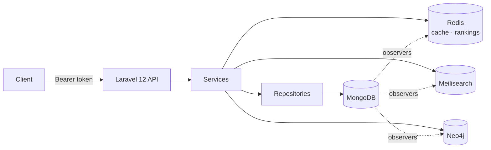

<div align="center">


# Knowledge Hub API

**REST API for a social knowledge-sharing platform** — versioned articles, comments, likes and follows, a feed, full-text search, graph-based recommendations and real-time rankings.

[](https://php.net)
[](https://laravel.com)
[](https://mongodb.com)
[](https://redis.io)
[](https://meilisearch.com)
[](https://neo4j.com)
[](#development)
[](#development)
[](LICENSE)

**English** · [Português (Brasil)](README.pt-BR.md)

</div>

## Overview

Knowledge Hub is a backend for publishing and discovering technical content. Users write articles (posts, wikis, tutorials, news), follow each other, comment and like; the API serves a feed, a typo-tolerant search, recommendations computed on a graph of users, articles and tags, and rankings of the most-read articles and most influential authors.

Each concern runs on the store that fits it:

| Store | Role |
|---|---|
| **MongoDB** | System of record — users, articles, versions, comments, likes, follows, tokens |
| **Redis** | Cache with key-based invalidation, and sorted sets for the article and user rankings |
| **Meilisearch** | Full-text search and autocomplete over articles (via Laravel Scout) |
| **Neo4j** | Graph of `User`, `Article`, `Tag` and `Category` nodes for recommendations |



Observers on the Mongo models keep the other stores in sync: saving an article re-indexes it in Meilisearch and upserts its node and `HAS_TAG`/`IN_CATEGORY` edges in Neo4j; a like or follow writes the matching edge; comments and likes update the counters on the article. Neo4j and Meilisearch are optional at runtime — if either is down, the endpoints that depend on it degrade gracefully instead of taking the API down.

## Highlights

- **Articles with automatic versioning** — every update of a versionable field snapshots the previous state into `article_versions`; the model can restore any version, compare two, or run a change without versioning.
- **Social graph** — follow/unfollow, followers and following lists, like/unlike, comments with ownership checks.
- **Feed** — public feed ordered by views, likes and recency; personalized feed restricted to the authors you follow.
- **Search** — full-text over title, content, excerpt, tags and categories, with autocomplete and filters, typo-tolerant out of the box.
- **Recommendations** — similar users (shared follows), related articles (shared tags/categories), most-followed authors and topics of interest, all as Cypher queries on Neo4j.
- **Rankings** — most-viewed articles tracked by a middleware into a Redis sorted set; an influence score per user with a documented formula.
- **Token auth** — Laravel Sanctum bearer tokens with logout, revoke-all and a revoked-token check on every request.
- **Quality gates** — 1,184 Pest tests, PHPStan level 10, Pint (PSR-12) and Rector.

## API reference

Base URL: `http://localhost:8004/api`. Authenticated routes take `Authorization: Bearer <token>`. A [Postman collection](postman/postman.json) covers every endpoint.

<details open>
<summary><b>Auth & profile</b></summary>

| Method | Endpoint | Auth | Notes |
|---|---|:---:|---|
| `POST` | `/register` | – | Returns user + token |
| `POST` | `/login` | – | Returns token |
| `POST` | `/logout` | ✓ | Revokes current token |
| `POST` | `/revoke-all` | ✓ | Revokes every token of the user |
| `GET` | `/me` | ✓ | Current user |
| `PUT` | `/me` | ✓ | Update name, username, bio, avatar |
| `GET` | `/users/{user}` | – | Public profile with counters; extra fields when authenticated |

</details>

<details>
<summary><b>Articles</b></summary>

| Method | Endpoint | Auth | Notes |
|---|---|:---:|---|
| `GET` | `/articles` | ✓ | Paginated list with filters and sorting (Spatie Query Builder) |
| `POST` | `/articles` | ✓ | `throttle:10,1` |
| `GET` | `/articles/{article}` | – | Counts a view (`TrackArticleView` middleware) |
| `PUT` | `/articles/{article}` | ✓ | Creates a version when a versionable field changes |
| `DELETE` | `/articles/{article}` | ✓ | Soft delete |
| `GET` | `/articles/popular` | – | Most viewed |
| `GET` | `/articles/{articleId}/related` | – | Neo4j: shared tags/categories |

Types: `article`, `post`, `wiki`, `tutorial`, `news`. Status: `draft`, `published`, `private`, `archived`. Slug and reading time are generated on save.

</details>

<details>
<summary><b>Comments, likes & follows</b></summary>

| Method | Endpoint | Auth | Notes |
|---|---|:---:|---|
| `GET` | `/articles/{articleId}/comments` | – | Paginated |
| `POST` | `/comments` | ✓ | `throttle:30,1` |
| `PUT` | `/comments/{comment}` | ✓ | Author only |
| `DELETE` | `/comments/{comment}` | ✓ | Author only, soft delete |
| `POST` | `/articles/{article}/like` | ✓ | Toggle, `throttle:60,1` |
| `GET` | `/articles/{article}/like/check` | ✓ | |
| `POST` | `/users/{user}/follow` | ✓ | Toggle, `throttle:30,1`, no self-follow |
| `GET` | `/users/{user}/follow/check` | ✓ | |
| `GET` | `/users/{user}/followers` | – | Paginated |
| `GET` | `/users/{user}/following` | – | Paginated |

</details>

<details>
<summary><b>Feed & search</b></summary>

| Method | Endpoint | Auth | Notes |
|---|---|:---:|---|
| `GET` | `/feed` | – | Public feed |
| `GET` | `/feed/public` | – | Same as `/feed` |
| `GET` | `/feed/personalized` | ✓ | Articles from followed authors (falls back to public when following nobody) |
| `GET` | `/search?q=` | – | Full-text with filters (status, type, tags, categories, dates) |
| `GET` | `/search/autocomplete?q=` | – | Prefix suggestions |
| `POST` | `/search/sync` | ✓ | Re-index all articles |

</details>

<details>
<summary><b>Recommendations (Neo4j)</b></summary>

| Method | Endpoint | Auth | Notes |
|---|---|:---:|---|
| `GET` | `/recommendations/users` | ✓ | Users who share follows with you |
| `GET` | `/recommendations/articles` | ✓ | Articles sharing tags/categories with the ones you liked, minus those you already liked |
| `GET` | `/recommendations/topics` | ✓ | Tags and categories of the articles you liked, by interaction count |
| `GET` | `/recommendations/authors` | – | Most-followed authors above a follower threshold |
| `GET` | `/recommendations/statistics` | – | Node and relationship counts |
| `POST` | `/recommendations/sync` | ✓ | Full re-sync of the graph |

Graph model: `(User)-[:AUTHORED]->(Article)`, `(User)-[:FOLLOWS]->(User)`, `(User)-[:LIKES]->(Article)`, `(Article)-[:HAS_TAG]->(Tag)`, `(Article)-[:IN_CATEGORY]->(Category)`.

</details>

<details>
<summary><b>Rankings (Redis)</b></summary>

| Method | Endpoint | Auth | Notes |
|---|---|:---:|---|
| `GET` | `/articles/ranking` | – | Top articles by views (`articles:ranking:views`) |
| `GET` | `/articles/ranking/statistics` | – | |
| `GET` | `/articles/{article}/ranking` | ✓ | Position and score of one article |
| `POST` | `/articles/ranking/sync` | ✓ | Rebuild from MongoDB |
| `GET` | `/users/ranking` | – | Top users by influence (`users:ranking:influence`) |
| `GET` | `/users/ranking/statistics` | – | |
| `GET` | `/users/{user}/ranking` | ✓ | Position and score breakdown |
| `POST` | `/users/{user}/ranking/recalculate` | ✓ | |
| `POST` | `/users/ranking/sync` | ✓ | Rebuild for every user |

Influence score:

```
score = followers × 2.0 + views × 0.5 + likes × 1.0 + comments × 0.8 + articles × 1.5
```

</details>

Health check: `GET /up`.

## Getting started

Requires Docker and Docker Compose.

```bash
git clone https://github.com/GabeSilvaDev/knowledge-hub.git
cd knowledge-hub
cp .env.example .env

docker compose up -d                                    # app + MongoDB + Redis + Meilisearch + Neo4j
docker exec -it knowledge-hub-app composer install
docker exec -it knowledge-hub-app php artisan key:generate
docker exec -it knowledge-hub-app php artisan migrate
```

The API answers at `http://localhost:8004/api`.

| Service | Container | Port |
|---|---|---|
| API (`php artisan serve`) | `knowledge-hub-app` | 8004 |
| MongoDB 6.0 | `knowledge-hub-mongo` | 27017 |
| Redis 7 | `knowledge-hub-redis` | 6379 |
| Meilisearch 1.12 | `knowledge-hub-search` | 7700 |
| Neo4j 5.26 + APOC | `knowledge-hub-neo4j` | 7474 (browser) · 7687 (bolt) |

### Console commands

```bash
php artisan articles:sync-ranking        # rebuild the article ranking from MongoDB
php artisan users:sync-ranking           # recompute the influence score of every user
php artisan neo4j:sync                   # full graph sync
php artisan neo4j:sync --entity=likes    # users | articles | follows | likes
php artisan neo4j:sync --clear           # wipe the graph first
php artisan scout:import "App\Models\Article"
```

## Development

```bash
docker exec -it knowledge-hub-app ./vendor/bin/pest           # 1,184 tests
docker exec -it knowledge-hub-app ./vendor/bin/phpstan analyse  # level 10
docker exec -it knowledge-hub-app ./vendor/bin/pint             # PSR-12
docker exec -it knowledge-hub-app ./vendor/bin/rector process --dry-run
```

Tests run against a `knowledge_hub_test` MongoDB database with the array cache driver and Scout disabled (`phpunit.xml`), so the suite needs only the `mongo` container. Feature tests cover every controller; unit tests cover services, repositories, DTOs, value objects, observers, cache, helpers and console commands.

## Project structure

```
app/
├── Cache/            Redis key generator and invalidator
├── Console/Commands/ articles:sync-ranking · users:sync-ranking · neo4j:sync
├── Contracts/        one interface per service and repository
├── DTOs/             typed input for create/update operations
├── Enums/            ArticleType · ArticleStatus · RecommendationType · UserRole
├── Exceptions/       domain exceptions rendered as JSON
├── Helpers/          slug and reading-time helpers
├── Http/
│   ├── Controllers/  thin controllers, one per resource
│   ├── Middleware/    CheckRevokedToken · TrackArticleView
│   └── Requests/     validation via Form Requests
├── Models/           MongoDB models (Article uses the Versionable trait)
├── Observers/        keep counters, Meilisearch and Neo4j in sync
├── Repositories/     MongoDB and Neo4j data access
├── Services/         business rules behind the contracts
├── Traits/           Versionable
└── ValueObjects/     Email · Password · Slug · Title · Username · …
```

### Design notes

- **Controllers → Services → Repositories.** Controllers validate (Form Requests) and delegate; services hold the rules; repositories are the only place that touches a store. Everything is bound through interfaces in `Contracts/`, which is what makes the Neo4j and Meilisearch pieces swappable in tests.
- **Value objects at the edges.** Email, password, username, slug and title are validated once when constructed, so a service never receives an unchecked primitive.
- **Versioning is a trait, not a feature flag.** `Versionable` hooks `updating`, compares the versionable fields and writes an `ArticleVersion` with an incrementing number. `restoreToVersion()`, `compareVersions()` and `withoutVersioning()` live on the model.
- **Cache invalidation is explicit.** `RedisCacheKeyGenerator` names keys per resource; `RedisCacheInvalidator` runs from the article observer after every write, so cached reads never outlive the data.
- **Revoked tokens are checked, not trusted.** `CheckRevokedToken` runs on every API request; `/logout` and `/revoke-all` take effect immediately rather than at token expiry.

## Data model

**MongoDB collections:** `users`, `articles`, `article_versions`, `comments`, `likes`, `followers`, `personal_access_tokens`.

**Redis:** `articles:ranking:views` and `users:ranking:influence` (sorted sets, 90-day TTL) plus resource caches.

**Meilisearch index:** `articles` — `title`, `slug`, `content`, `excerpt`, `author_id`, `status`, `type`, `tags`, `categories`, `published_at`, `created_at`.

**Neo4j:** nodes `User`, `Article`, `Tag`, `Category`; relationships `AUTHORED`, `FOLLOWS`, `LIKES`, `HAS_TAG`, `IN_CATEGORY`.

## Configuration

Everything comes from `.env` (see `.env.example`). The variables that matter beyond Laravel's defaults:

| Variable | Default | Purpose |
|---|---|---|
| `DB_CONNECTION` / `DB_HOST` / `DB_DATABASE` | `mongodb` / `mongo` / `knowledge_hub` | MongoDB |
| `REDIS_HOST` / `REDIS_*_DB` | `redis` | Cache, sessions, tokens, queue |
| `SCOUT_DRIVER` / `MEILISEARCH_HOST` / `MEILISEARCH_KEY` | `meilisearch` / `http://meilisearch:7700` | Search |
| `NEO4J_HOST` / `NEO4J_PORT` / `NEO4J_USERNAME` / `NEO4J_PASSWORD` | `neo4j` / `7687` | Graph |

## License

[MIT](LICENSE) © [Gabriel Silva](https://github.com/GabeSilvaDev)
