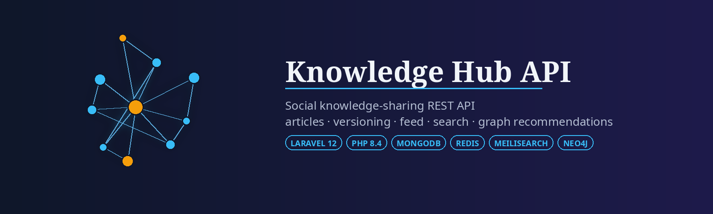
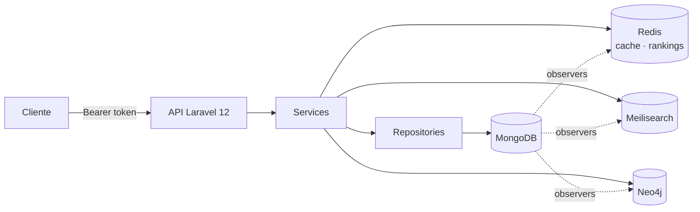

<div align="center">



# Knowledge Hub API

**API REST para uma plataforma social de compartilhamento de conhecimento** — artigos versionados, comentários, likes e seguidores, feed, busca full-text, recomendações em grafo e rankings em tempo real.

[](https://php.net)
[](https://laravel.com)
[](https://mongodb.com)
[](https://redis.io)
[](https://meilisearch.com)
[](https://neo4j.com)
[](#desenvolvimento)
[](#desenvolvimento)
[](LICENSE)

[English](README.md) · **Português (Brasil)**

</div>

## Visão geral

O Knowledge Hub é o backend de uma plataforma para publicar e descobrir conteúdo técnico. Usuários escrevem artigos (posts, wikis, tutoriais, notícias), seguem uns aos outros, comentam e curtem; a API entrega um feed, uma busca tolerante a erros de digitação, recomendações calculadas sobre um grafo de usuários, artigos e tags, e rankings dos artigos mais lidos e dos autores mais influentes.

Cada responsabilidade roda no banco que melhor a atende:

| Banco | Papel |
|---|---|
| **MongoDB** | Fonte da verdade — usuários, artigos, versões, comentários, likes, seguidores, tokens |
| **Redis** | Cache com invalidação por chave, e sorted sets para os rankings de artigos e usuários |
| **Meilisearch** | Busca full-text e autocomplete de artigos (via Laravel Scout) |
| **Neo4j** | Grafo de nós `User`, `Article`, `Tag` e `Category` para recomendações |



Observers nos models do Mongo mantêm os outros bancos sincronizados: salvar um artigo reindexa no Meilisearch e faz upsert do nó e das arestas `HAS_TAG`/`IN_CATEGORY` no Neo4j; um like ou follow grava a aresta correspondente; comentários e likes atualizam os contadores do artigo. Neo4j e Meilisearch são opcionais em tempo de execução — se um deles cair, os endpoints que dependem dele degradam com elegância em vez de derrubar a API.

## Destaques

- **Artigos com versionamento automático** — toda atualização de um campo versionável grava o estado anterior em `article_versions`; o model restaura qualquer versão, compara duas, ou executa uma alteração sem versionar.
- **Grafo social** — seguir/deixar de seguir, listas de seguidores e seguindo, curtir/descurtir, comentários com checagem de autoria.
- **Feed** — feed público ordenado por views, likes e recência; feed personalizado restrito aos autores que você segue.
- **Busca** — full-text em título, conteúdo, resumo, tags e categorias, com autocomplete e filtros, tolerante a erros de digitação.
- **Recomendações** — usuários similares (follows em comum), artigos relacionados (tags/categorias em comum), autores mais seguidos e tópicos de interesse, tudo em consultas Cypher no Neo4j.
- **Rankings** — artigos mais vistos rastreados por um middleware num sorted set do Redis; score de influência por usuário com fórmula documentada.
- **Autenticação por token** — bearer tokens do Laravel Sanctum com logout, revogação total e checagem de token revogado em toda requisição.
- **Portões de qualidade** — 1.184 testes Pest, PHPStan nível 10, Pint (PSR-12) e Rector.

## Referência da API

URL base: `http://localhost:8004/api`. Rotas autenticadas recebem `Authorization: Bearer <token>`. Uma [coleção Postman](postman/postman.json) cobre todos os endpoints.

<details open>
<summary><b>Autenticação e perfil</b></summary>

| Método | Endpoint | Auth | Observações |
|---|---|:---:|---|
| `POST` | `/register` | – | Retorna usuário + token |
| `POST` | `/login` | – | Retorna token |
| `POST` | `/logout` | ✓ | Revoga o token atual |
| `POST` | `/revoke-all` | ✓ | Revoga todos os tokens do usuário |
| `GET` | `/me` | ✓ | Usuário atual |
| `PUT` | `/me` | ✓ | Atualiza nome, username, bio, avatar |
| `GET` | `/users/{user}` | – | Perfil público com contadores; campos extras quando autenticado |

</details>

<details>
<summary><b>Artigos</b></summary>

| Método | Endpoint | Auth | Observações |
|---|---|:---:|---|
| `GET` | `/articles` | ✓ | Lista paginada com filtros e ordenação (Spatie Query Builder) |
| `POST` | `/articles` | ✓ | `throttle:10,1` |
| `GET` | `/articles/{article}` | – | Conta uma visualização (middleware `TrackArticleView`) |
| `PUT` | `/articles/{article}` | ✓ | Cria uma versão quando um campo versionável muda |
| `DELETE` | `/articles/{article}` | ✓ | Soft delete |
| `GET` | `/articles/popular` | – | Mais vistos |
| `GET` | `/articles/{articleId}/related` | – | Neo4j: tags/categorias em comum |

Tipos: `article`, `post`, `wiki`, `tutorial`, `news`. Status: `draft`, `published`, `private`, `archived`. Slug e tempo de leitura são gerados ao salvar.

</details>

<details>
<summary><b>Comentários, likes e seguidores</b></summary>

| Método | Endpoint | Auth | Observações |
|---|---|:---:|---|
| `GET` | `/articles/{articleId}/comments` | – | Paginado |
| `POST` | `/comments` | ✓ | `throttle:30,1` |
| `PUT` | `/comments/{comment}` | ✓ | Só o autor |
| `DELETE` | `/comments/{comment}` | ✓ | Só o autor, soft delete |
| `POST` | `/articles/{article}/like` | ✓ | Toggle, `throttle:60,1` |
| `GET` | `/articles/{article}/like/check` | ✓ | |
| `POST` | `/users/{user}/follow` | ✓ | Toggle, `throttle:30,1`, sem auto-follow |
| `GET` | `/users/{user}/follow/check` | ✓ | |
| `GET` | `/users/{user}/followers` | – | Paginado |
| `GET` | `/users/{user}/following` | – | Paginado |

</details>

<details>
<summary><b>Feed e busca</b></summary>

| Método | Endpoint | Auth | Observações |
|---|---|:---:|---|
| `GET` | `/feed` | – | Feed público |
| `GET` | `/feed/public` | – | Igual a `/feed` |
| `GET` | `/feed/personalized` | ✓ | Artigos dos autores seguidos (cai no público quando não segue ninguém) |
| `GET` | `/search?q=` | – | Full-text com filtros (status, tipo, tags, categorias, datas) |
| `GET` | `/search/autocomplete?q=` | – | Sugestões por prefixo |
| `POST` | `/search/sync` | ✓ | Reindexa todos os artigos |

</details>

<details>
<summary><b>Recomendações (Neo4j)</b></summary>

| Método | Endpoint | Auth | Observações |
|---|---|:---:|---|
| `GET` | `/recommendations/users` | ✓ | Usuários que compartilham follows com você |
| `GET` | `/recommendations/articles` | ✓ | Artigos com tags/categorias em comum com os que você curtiu, menos os já curtidos |
| `GET` | `/recommendations/topics` | ✓ | Tags e categorias dos artigos que você curtiu, por número de interações |
| `GET` | `/recommendations/authors` | – | Autores mais seguidos acima de um mínimo de seguidores |
| `GET` | `/recommendations/statistics` | – | Contagem de nós e relacionamentos |
| `POST` | `/recommendations/sync` | ✓ | Ressincroniza o grafo inteiro |

Modelo do grafo: `(User)-[:AUTHORED]->(Article)`, `(User)-[:FOLLOWS]->(User)`, `(User)-[:LIKES]->(Article)`, `(Article)-[:HAS_TAG]->(Tag)`, `(Article)-[:IN_CATEGORY]->(Category)`.

</details>

<details>
<summary><b>Rankings (Redis)</b></summary>

| Método | Endpoint | Auth | Observações |
|---|---|:---:|---|
| `GET` | `/articles/ranking` | – | Top artigos por views (`articles:ranking:views`) |
| `GET` | `/articles/ranking/statistics` | – | |
| `GET` | `/articles/{article}/ranking` | ✓ | Posição e score de um artigo |
| `POST` | `/articles/ranking/sync` | ✓ | Reconstrói a partir do MongoDB |
| `GET` | `/users/ranking` | – | Top usuários por influência (`users:ranking:influence`) |
| `GET` | `/users/ranking/statistics` | – | |
| `GET` | `/users/{user}/ranking` | ✓ | Posição e detalhamento do score |
| `POST` | `/users/{user}/ranking/recalculate` | ✓ | |
| `POST` | `/users/ranking/sync` | ✓ | Reconstrói para todos os usuários |

Score de influência:

```
score = seguidores × 2.0 + views × 0.5 + likes × 1.0 + comentários × 0.8 + artigos × 1.5
```

</details>

Health check: `GET /up`.

## Como rodar

Requer Docker e Docker Compose.

```bash
git clone https://github.com/GabeSilvaDev/knowledge-hub.git
cd knowledge-hub
cp .env.example .env

docker compose up -d                                    # app + MongoDB + Redis + Meilisearch + Neo4j
docker exec -it knowledge-hub-app composer install
docker exec -it knowledge-hub-app php artisan key:generate
docker exec -it knowledge-hub-app php artisan migrate
```

A API responde em `http://localhost:8004/api`.

| Serviço | Container | Porta |
|---|---|---|
| API (`php artisan serve`) | `knowledge-hub-app` | 8004 |
| MongoDB 6.0 | `knowledge-hub-mongo` | 27017 |
| Redis 7 | `knowledge-hub-redis` | 6379 |
| Meilisearch 1.12 | `knowledge-hub-search` | 7700 |
| Neo4j 5.26 + APOC | `knowledge-hub-neo4j` | 7474 (browser) · 7687 (bolt) |

### Comandos de console

```bash
php artisan articles:sync-ranking        # reconstrói o ranking de artigos a partir do MongoDB
php artisan users:sync-ranking           # recalcula o score de influência de todos os usuários
php artisan neo4j:sync                   # sincronização completa do grafo
php artisan neo4j:sync --entity=likes    # users | articles | follows | likes
php artisan neo4j:sync --clear           # limpa o grafo antes
php artisan scout:import "App\Models\Article"
```

## Desenvolvimento

```bash
docker exec -it knowledge-hub-app ./vendor/bin/pest           # 1.184 testes
docker exec -it knowledge-hub-app ./vendor/bin/phpstan analyse  # nível 10
docker exec -it knowledge-hub-app ./vendor/bin/pint             # PSR-12
docker exec -it knowledge-hub-app ./vendor/bin/rector process --dry-run
```

Os testes rodam contra o banco MongoDB `knowledge_hub_test`, com cache em array e Scout desligado (`phpunit.xml`), então a suíte precisa só do container `mongo`. Testes de feature cobrem todos os controllers; testes unitários cobrem services, repositories, DTOs, value objects, observers, cache, helpers e comandos de console.

## Estrutura do projeto

```
app/
├── Cache/            gerador de chaves e invalidador do Redis
├── Console/Commands/ articles:sync-ranking · users:sync-ranking · neo4j:sync
├── Contracts/        uma interface por service e repository
├── DTOs/             entrada tipada para operações de criação/atualização
├── Enums/            ArticleType · ArticleStatus · RecommendationType · UserRole
├── Exceptions/       exceções de domínio renderizadas como JSON
├── Helpers/          slug e tempo de leitura
├── Http/
│   ├── Controllers/  controllers finos, um por recurso
│   ├── Middleware/    CheckRevokedToken · TrackArticleView
│   └── Requests/     validação via Form Requests
├── Models/           models MongoDB (Article usa a trait Versionable)
├── Observers/        mantêm contadores, Meilisearch e Neo4j em sincronia
├── Repositories/     acesso a dados no MongoDB e no Neo4j
├── Services/         regras de negócio por trás dos contratos
├── Traits/           Versionable
└── ValueObjects/     Email · Password · Slug · Title · Username · …
```

### Decisões de projeto

- **Controllers → Services → Repositories.** Controllers validam (Form Requests) e delegam; services guardam as regras; repositories são o único lugar que toca um banco. Tudo é ligado por interfaces em `Contracts/`, o que torna as partes de Neo4j e Meilisearch substituíveis nos testes.
- **Value objects nas bordas.** Email, senha, username, slug e título são validados uma vez ao construir, então um service nunca recebe um primitivo sem checagem.
- **Versionamento é uma trait, não uma flag.** `Versionable` intercepta `updating`, compara os campos versionáveis e grava um `ArticleVersion` com número incremental. `restoreToVersion()`, `compareVersions()` e `withoutVersioning()` vivem no model.
- **Invalidação de cache é explícita.** `RedisCacheKeyGenerator` nomeia chaves por recurso; `RedisCacheInvalidator` roda a partir do observer de artigo após cada escrita, então leituras em cache nunca sobrevivem aos dados.
- **Tokens revogados são checados, não confiados.** `CheckRevokedToken` roda em toda requisição da API; `/logout` e `/revoke-all` valem na hora, não na expiração do token.

## Modelo de dados

**Collections MongoDB:** `users`, `articles`, `article_versions`, `comments`, `likes`, `followers`, `personal_access_tokens`.

**Redis:** `articles:ranking:views` e `users:ranking:influence` (sorted sets, TTL de 90 dias) mais caches por recurso.

**Índice Meilisearch:** `articles` — `title`, `slug`, `content`, `excerpt`, `author_id`, `status`, `type`, `tags`, `categories`, `published_at`, `created_at`.

**Neo4j:** nós `User`, `Article`, `Tag`, `Category`; relacionamentos `AUTHORED`, `FOLLOWS`, `LIKES`, `HAS_TAG`, `IN_CATEGORY`.

## Configuração

Tudo vem do `.env` (veja `.env.example`). As variáveis que importam além dos padrões do Laravel:

| Variável | Padrão | Uso |
|---|---|---|
| `DB_CONNECTION` / `DB_HOST` / `DB_DATABASE` | `mongodb` / `mongo` / `knowledge_hub` | MongoDB |
| `REDIS_HOST` / `REDIS_*_DB` | `redis` | Cache, sessões, tokens, fila |
| `SCOUT_DRIVER` / `MEILISEARCH_HOST` / `MEILISEARCH_KEY` | `meilisearch` / `http://meilisearch:7700` | Busca |
| `NEO4J_HOST` / `NEO4J_PORT` / `NEO4J_USERNAME` / `NEO4J_PASSWORD` | `neo4j` / `7687` | Grafo |

## Licença

[MIT](LICENSE) © [Gabriel Silva](https://github.com/GabeSilvaDev)
